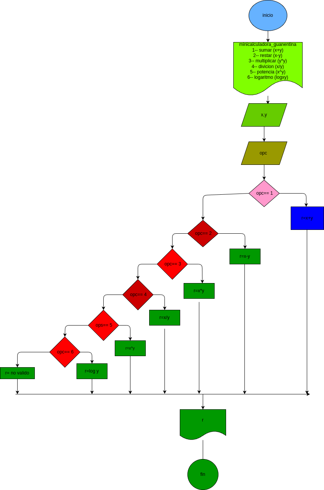

# minicalculadora_guanentina
calculadora con 6 funciones basicas
## analisis

### input
variables de entrada:

x,y los numeros que se ingresen

opc: la opcion de operacion escogida

## procesing
si se selecciona opc 1 se suma x+y

si se selecciona opc 2 se resta x-y

si se selecciona opc 3 se multiplica x*y

si se selecciona opc 4 se divide x/y

si se selecciona opc 5 se potencia x^y

si se selecciona opc 6 se hace logaritmacion logxy

## output

el resultado de la operacion

## diseño
 "diagrama de flujo"

